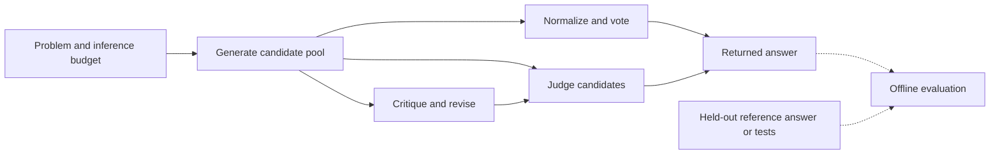

**CS329A Part 2: Test-Time Compute Scaling — Strategies, Techniques, and System Design**

Prepared 2026-09-26. Scope: Stanford CS329A, Autumn 2025, its public homework framework, and the research assigned for Lecture 2. This is a technical explanation and implementation guide; no model evaluation was run for this document.

Updated 2026-10-02 with the EmoGame session decisions and repository-grounded application in Section 16: deterministic reporting, hypothetical invoice analysis, and proposed inference-time evidence acquisition and verification. The original course discussion remains general; its multiple-report sampling strategies are not requirements for EmoGame.

The central strategy is to allocate inference work across **candidate generation, verification, and revision** so that additional computation increases the probability of returning a useful answer. Increasing the number of samples is only one allocation choice. A system can also spend computation on better checks, alternative models, corrected trajectories, or combinations of these operations.

“CS329A system” here means the course's agent-building framework and public homework interfaces. CS329A is a course covering several systems and methods. This document does not assert that its homework repository implements every technique discussed in the lectures. The [official syllabus](https://cs329a.stanford.edu/) identifies repeated sampling, Archon, compute-optimal allocation, and the explanation of inference scaling laws as Lecture 2 readings.

The requested [Part 2 explanatory page](https://kenhuangus.github.io/self-improving-agent/#part-02) supplies the topic map. Official source code and original papers supply the technical evidence. Explanations marked **design guidance** or **worked example** are this document's engineering analysis, rather than measured CS329A results.

**1. What computation is being scaled?**

Keep generator parameters fixed during a request and change how the system uses them:

| Dimension | What increases | Purpose | Main limitation |
|---|---|---|---|
| Breadth | Number of independently generated candidates, $K$ | Explore alternative solutions | A selector must recognize useful candidates |
| Depth | Number of critique/revision rounds, $R$ | Repair an existing approach | Feedback can reinforce mistakes or cause regressions |
| Reasoning length | Tokens allowed within a generation | Permit a longer solution attempt | More tokens do not guarantee better reasoning |
| Verification | Tests, judge calls, or checking effort | Reduce selection errors | A weak verifier can be confidently wrong |
| Diversity | Models, prompts, or solution strategies | Explore different failure modes | More expensive configuration and comparison |
| Search | Branches, depth, and node evaluations | Recover from intermediate mistakes | Search can optimize flaws in its scoring function |

These are distinct controls. Increasing `max_workers` changes concurrent execution; increasing `n_samples` changes how many candidates are requested. Increasing a token ceiling changes the maximum available reasoning space; actual token consumption may remain below it.

For EmoGame, these controls can apply upstream of a deterministic report: breadth can explore evidence queries or sources, depth can follow up an unresolved finding, and prompt diversity can formulate alternative retrieval queries or checks. This is an application proposed in Section 16, not an additional verified capability of the course framework. Ordinary retrieval becomes a test-time scaling experiment when its budget or allocation is deliberately varied and the resulting quality and cost are measured.

A useful mathematical description, introduced here as a design objective, is

$$
\pi^*(x,B)=\arg\max_{\pi}\;\mathbb E[U(\hat y,x)]
\quad\text{subject to}\quad C(\pi,x)\le B.
$$

Here $x$ is the problem, $\pi$ is an inference policy, $\hat y$ is the returned answer, $U$ is task utility, and $C$ includes generation, checking, revision, and routing. For exact-answer math, utility can be correctness. For a report-writing agent, utility needs a rubric covering factual support, completeness, and instruction adherence.

The practical question is therefore: **what should the next unit of inference budget buy for this particular problem?**

**2. What the public CS329A framework actually provides**

The inspected HW1 revision is `6f6eb053aab7b0a77d7b5947703feea5b56b5fca`; HW2 is `f6a763256f1013f49fdddff9cf1c812700f4634a`. Commit IDs were verified through GitHub's commit API; linked files were inspected at those revisions.

| Layer | Verified interface or artifact | Role |
|---|---|---|
| Math task | `AIME25`, `get_problems()`, `get_system_prompt()` | Supplies problems and prompting context |
| Sampler factory | `get_sampler("sample_multiple", ...)`, `get_sampler("greedy", ...)` | Constructs repeated-sampling or greedy methods |
| Generation | `SampleMultiple` | Returns candidates grouped by problem |
| Transport | `LiteLLMModel` | Sends API requests with concurrency and retries |
| Offline math scoring | `get_verifier("aime25")`, `AIME25Verifier.verify(...)` | Compares a candidate's answer with a reference |
| Student methods | `MajorityVoting`, `LLMVoting`, `SelfImprovementSystem` | Notebook scaffolds to complete and evaluate |
| Code verification | `HumanEvalVerifier` | Executes candidate code against supplied tests through a runner |

The task adapter loads 30 AIME25 problems, offers a five-problem debugging subset, and shuffles with a seeded random generator. Its prompt requests a worked mathematical solution and a final answer. [Pinned task adapter](https://github.com/stanford-cs329a/cs329a-homework1-fall2025-public/blob/6f6eb053aab7b0a77d7b5947703feea5b56b5fca/cs329_hw1/tasks/aime25.py).

The sampler factory requires positive temperature for `sample_multiple` and zero temperature for `greedy`. Direct construction of `SampleMultiple` does not impose that factory assertion. This distinction matters when configuring a deterministic judge. [Pinned sampler factory](https://github.com/stanford-cs329a/cs329a-homework1-fall2025-public/blob/6f6eb053aab7b0a77d7b5947703feea5b56b5fca/cs329_hw1/methods/__init__.py).

The HW1 notebook sets a one-sample baseline at temperature 0.7, compares vote budgets `1, 2, 4, 8, 16`, and uses 16 candidates for LLM aggregation. Several central methods remain TODOs. Its aggregator produces free-form restatement, rather than an enforced candidate index. The feedback exercise uses generation, model critique, and regeneration; the displayed structure contains no optimizer or weight update. Consequently, this is an instructional scaffold, and its “RLEF” naming does not establish implementation of the research training algorithm. [Pinned HW1 notebook](https://github.com/stanford-cs329a/cs329a-homework1-fall2025-public/blob/6f6eb053aab7b0a77d7b5947703feea5b56b5fca/student_homework1.ipynb).

The data flow below is a conceptual organization of these operations. Dashed scoring edges belong to evaluation after an answer is chosen.



For a strict selection experiment, the judge must return an existing candidate. An aggregator that writes a new solution constitutes an additional generation step and needs separate accounting.

**3. Coverage: why repeated sampling can help**

Let $p_i$ be the probability that one sample solves problem $i$. Under identically distributed, independent sampling conditional on that problem,

$$
P_i(\text{at least one correct in }K)=1-(1-p_i)^K.
$$

Across $N$ problems, expected coverage is

$$
C(K)=\frac1N\sum_{i=1}^{N}\left[1-(1-p_i)^K\right].
$$

Coverage records whether a correct candidate exists; a deployable system additionally needs to find it. *Large Language Monkeys* studies this difference across repeated model samples and agent trajectories. It observes that candidate coverage can keep improving after practical answer-selection methods begin to saturate. Its findings are task- and verifier-dependent. [Brown et al., original paper](https://arxiv.org/html/2407.21787v3).

**Worked example — theoretical probabilities, not benchmark results:**

| One-attempt correctness $p$ | $K=1$ | $K=4$ | $K=16$ | $K=64$ |
|---|---:|---:|---:|---:|
| 0.50 | 50.0% | 93.8% | 99.998% | Approximately 100% |
| 0.10 | 10.0% | 34.4% | 81.5% | 99.9% |
| 0.01 | 1.0% | 3.9% | 14.9% | 47.4% |

These calculations show why a uniform sample budget can be wasteful. Easy tasks quickly exhaust the benefit of additional breadth. Very hard tasks may consume many attempts without producing a correct candidate. Intermediate cases can offer a useful opportunity for extra inference.

The marginal coverage gain is

$$
\Delta C_i(K)=p_i(1-p_i)^K.
$$

This expression is a mathematical diagnostic, not a directly available routing signal: $p_i$ is generally unknown at deployment. A controller must estimate the value of another attempt without accessing the held-out answer.

Shared systematic weaknesses do not by themselves disprove conditional independence. Independent draws can repeatedly favor the same wrong solution. In contrast, copying previous responses, using identical cached outputs, or conditioning later generations on earlier ones changes the sampling assumptions. Never apply the iid formula mechanically to an adaptive revision trajectory.

**4. Why aggregate curves can resemble a power law**

Schaeffer et al. explain how heterogeneous problem difficulty can reconcile per-problem exponential improvement with aggregate power behavior. For a distribution of one-attempt success probabilities with density $f(p)$,

$$
C(K)=1-\int_0^1(1-p)^K f(p)\,dp.
$$

When $f(p)$ behaves like $c p^{\beta-1}$ near zero under the paper's regularity assumptions, a long tail of hard problems yields

$$
-\log C(K)\sim c\,\Gamma(\beta)K^{-\beta}.
$$

The corresponding fit is $C(K)\approx\exp(-A K^{-\beta})$. At sufficiently high coverage, its first-order approximation is $1-AK^{-\beta}$. The relevant logarithm is of **coverage**, not of one minus coverage. This is not a universal scaling law for arbitrary tasks, selectors, or dependent searches. [Schaeffer et al., equations and assumptions](https://arxiv.org/html/2502.17578v1).

**Design guidance:** fit curves only over measured budgets and identify the fitted quantity. A fit to oracle coverage cannot forecast judged-answer accuracy without a model of selection error. With a finite task set and positive minimum $p_i$, eventual asymptotic behavior can also differ from an apparent power law over the sampled range.

**5. Parallel scaling through repeated sampling**

The practical procedure is to hold the problem fixed, draw multiple candidate solutions, and apply a declared aggregation or selection rule. The CS329A `SampleMultiple` class repeats each prompt, dispatches the resulting requests, and groups responses back into a list per problem. Both simple sampler classes configure a 4,096-token output ceiling. [Pinned sampling implementation](https://github.com/stanford-cs329a/cs329a-homework1-fall2025-public/blob/6f6eb053aab7b0a77d7b5947703feea5b56b5fca/cs329_hw1/methods/simple_samplers.py).

**Design guidance:** candidate diversity should be assessed alongside candidate quality. Track distinct normalized answers and, where practical, distinct approaches. Increasing temperature may diversify answers but also increase invalid output. Model ensembles may introduce different approaches, but their costs and individual capabilities differ; a larger model ensemble is not an equal-compute comparison with repeated sampling from a single model.

For diagnostic comparisons, cache one ordered pool per problem and evaluate prefixes of that same pool. This makes changes in vote budget interpretable and allows selectors to be compared on identical candidates. Keep the order reproducible and avoid sorting the pool by correctness or score before forming the prefixes.

There is an accounting distinction: evaluating the first four candidates of a cached 16-candidate pool estimates a four-candidate policy, but the experiment actually generated 16. Report both the counterfactual policy cost and the total cost of collecting the experiment.

**6. Majority voting and self-consistency**

Self-consistency samples alternative reasoning paths and aggregates their final answers. This makes agreement over answers useful even when the detailed solutions differ. The original work evaluates this strategy on arithmetic and commonsense reasoning tasks. [Wang et al., Self-Consistency](https://arxiv.org/abs/2203.11171).

For candidates $y_1,\ldots,y_K$, let $a_j=\operatorname{normalize}(y_j)$. The voting rule is

$$
\hat a=\arg\max_a\sum_{j=1}^{K}\mathbf1[a_j=a].
$$

Although conventionally called majority voting, this is usually **plurality voting**: the winner need not receive more than half the votes.

**Worked example:** eight answers are `42, 42, 42, 17, 17, 17, 17, 23`. If the correct answer is 42, coverage succeeds while voting returns 17. Sampling more from a distribution whose most probable answer is wrong will eventually make the wrong winner more stable.

**Design guidance:** specify the parser, normalization rules, treatment of invalid outputs, and tie-breaking rule before evaluation. Keep malformed candidates in the cost and failure counts, even if they are excluded from valid-answer voting. If no valid answer remains, return a recorded failure or abstention. Never merge parse failures into a single answer category that can win the vote.

The highest vote share is an agreement statistic, not a calibrated probability of correctness. Use held-out calibration before interpreting a threshold such as 75% agreement as a confidence guarantee.

**7. Best-of-N, reward models, and LLM judging**

A strict best-of-N system scores each candidate and returns one of them:

$$
\hat y=y_{\arg\max_j s(x,y_j)}.
$$

Possible scores include test outcomes, a learned outcome reward, a process score, or an LLM judgment. A judge can inspect aspects of a solution that answer voting ignores, but its reasoning remains fallible.

For strict selection from a fixed pool, define returned-answer accuracy $A(K)$ and the verification gap

$$
G(K)=C(K)-A(K)\ge0.
$$

If correct selection is impossible without a correct pool member and $C(K)>0$, then

$$
A(K)=C(K)\,P(\text{select correct}\mid\text{pool contains correct}).
$$

These event identities explain two distinct improvement targets: create more solvable pools, or recover a larger fraction of already solvable pools. They also explain why increasing sample count can fail to improve the returned answer.

When $C(K)=0$, strict selection has $A(K)=0$; conditional selection success is undefined and should be reported as not applicable.

**Design guidance:** have a strict selector return a validated `candidate_id`, with an explicit fallback for malformed or out-of-range output. Randomize candidate presentation for position-bias checks. Judge correctness and constraint satisfaction separately from writing style. Compare a judge with voting on the same cached pool.

If the judge synthesizes, corrects, or rewrites an answer, evaluate it as a generative aggregator. The final answer may fall outside the original pool, so the original-pool coverage ceiling no longer applies. Preserve the newly generated artifact and count its inference cost.

One long judge call can consume more tokens than several short generation calls. A comparison of 16 generation calls against 16 generation calls plus one judge is therefore only a call-count comparison, not a full computation comparison.

**8. Sequential scaling through feedback and revision**

A general revision loop is

$$
y_0\sim p_\theta(\cdot\mid x),\qquad
f_t=F(x,y_t),\qquad
y_{t+1}\sim p_\theta(\cdot\mid x,y_t,f_t).
$$

The information in $f_t$ determines what the loop can repair. A failing test with actual and expected output identifies a concrete defect. A generic request to “think again” supplies much less diagnostic information.

Self-Refine uses the same model to draft, provide feedback, and revise without additional training. It is a relevant inference-time counterpart to the course exercise. Its reported gains concern the tasks and models in that study. [Madaan et al., Self-Refine](https://arxiv.org/abs/2303.17651).

RLEF, the research method cited by the course, trains code models through reinforcement learning with execution feedback. Training that capability and invoking a critique loop during inference are separate operations. [Gehring et al., RLEF](https://arxiv.org/abs/2410.02089).

**Design guidance:** prefer revision when a candidate has a plausible approach and feedback identifies a repairable error. Consider a fresh branch when the approach violates the specification, repeats the same failure, or cannot be checked. Preserve earlier candidates and select using inference-time evidence; automatically returning the last revision can discard a correct earlier answer.

A loop with one initial generation and $R$ separate critique/regeneration rounds has a nominal $1+2R$ model-call cost, before additional checks or retries. Context usually grows because each revision consumes prior text. Thus, equal call counts need not mean equal token budgets.

Measure wrong-to-correct repairs and correct-to-wrong regressions separately. The net accuracy change is

$$
\Delta A=\frac{n_{\mathrm{wrong\to correct}}-n_{\mathrm{correct\to wrong}}}{N}.
$$

This prevents a report from presenting successful repairs while hiding damage to initially correct outputs.

**9. Verification: separate evidence available during inference from held-out scoring**

The most consequential interface boundary is between a check the agent can legitimately use and a reference available only to the evaluator.

| Check | Available to the inference policy? | What a positive result establishes |
|---|---|---|
| AIME reference-answer comparison | Only in a declared oracle experiment | Agreement with the benchmark answer under the parser |
| Held-out benchmark tests | For final evaluation | Passing those particular tests |
| Public specification and allowed development tests | Yes | Consistency with the checked requirements |
| Newly generated tests | Yes, under the declared protocol | Consistency with possibly fallible generated expectations |
| LLM judge | Yes | A model's assessment |
| Formal proof checker | When the task supplies a formal specification | Validity relative to that specification and checker |

The AIME verifier extracts and normalizes an answer, then checks mathematical equivalence with the supplied reference. Its equality check has a two-second timeout; timeout and caught equality-check errors return zero. It checks answer equivalence, not the validity of every reasoning step. [Pinned AIME verifier](https://github.com/stanford-cs329a/cs329a-homework1-fall2025-public/blob/6f6eb053aab7b0a77d7b5947703feea5b56b5fca/cs329_hw1/methods/aime25_verifier.py).

HW2 extends the exercise to code sampling, judging, and generated tests. Its `LLMJudge` scaffold specifies an index-or-null decision and includes student TODOs. This is closer to strict candidate selection than free-form mathematical restatement. [Pinned HW2 notebook](https://github.com/stanford-cs329a/cs329a-homework2-fall2025-public/blob/f6a763256f1013f49fdddff9cf1c812700f4634a/homework.ipynb).

`HumanEvalVerifier` accepts either a benchmark-style test snippet or structured `TestCase` objects and delegates execution to a runner. Its result exposes pass status, test counts, output, exceptions, and execution time. These fields make execution feedback inspectable; their existence does not establish that the entire evaluation harness has been validated. [Pinned code verifier](https://github.com/stanford-cs329a/cs329a-homework2-fall2025-public/blob/f6a763256f1013f49fdddff9cf1c812700f4634a/cs329_hw/methods/verifiers.py).

The generated-test scaffold specifies cases with names, arguments, keyword arguments, and expected outputs; generation remains a student implementation task. [Pinned generated-test interface](https://github.com/stanford-cs329a/cs329a-homework2-fall2025-public/blob/f6a763256f1013f49fdddff9cf1c812700f4634a/cs329_hw/methods/llm_unit_test.py).

**Design guidance:** validate a verifier using known-correct examples and deliberately incorrect variants before drawing a scaling curve. Generated tests require both checks: accepting known-correct code measures one property, while rejecting incorrect code measures another. A test suite that accepts every implementation has perfect acceptance of correct code and no useful discrimination.

Keep hidden answers and tests out of generation, judging, routing, revision, and stopping decisions. If they are used to select the best candidate, label the result oracle-assisted. Such a run estimates potential coverage; it does not estimate an ordinary deployment policy.

**10. Outcome rewards, process rewards, and search**

An outcome reward model assesses a complete response. A process reward model evaluates intermediate reasoning steps. *Let's Verify Step by Step* studies process supervision for mathematical reasoning and provides step-level labels through PRM800K. The evidence supports the method in its evaluated setting, not a guarantee that every process score transfers to every task. [Lightman et al., original paper](https://arxiv.org/abs/2305.20050).

**Design guidance:** an intermediate score can help prune a branch before spending the full solution budget. However, a low-scoring partial solution might still lead to a correct unconventional solution. Search must balance pruning with maintaining alternatives. Step-score aggregation also matters: products can favor short trajectories, while averages can conceal one fatal error. Choose an aggregation rule through held-out validation.

Tree search combines breadth and depth: expand alternative actions, evaluate partial states, and revisit promising branches. LATS is a related later-course example combining Monte Carlo Tree Search, model-based evaluation, reflection, and environment feedback. [Zhou et al., LATS](https://arxiv.org/abs/2310.04406).

Flat best-of-N samples complete paths from the start. Tree search shares prefixes and spends additional effort at selected states. This can reduce repeated work, but it requires useful intermediate feedback and correct state management. A terminal-answer checker alone does not automatically provide a reliable value function for unfinished solutions.

These techniques extend Part 2's compute-allocation idea. They are not implemented process-reward or tree-search capabilities of the inspected HW1 package.

**11. Difficulty-dependent allocation of breadth and depth**

Snell et al. study process-reward-guided search and sequential revisions, finding that effective allocations depend on difficulty and budget. Their revision setup uses a fine-tuned revision model. Their reported compute-efficiency gains are conditional experimental results. In particular, Appendix C estimates predicted difficulty using verifier scores over 2,048 samples per question and excludes that estimation cost from the analysis. The headline savings therefore do not establish equivalent end-to-end savings for a deployed router. [Snell et al., original text and Appendix C](https://arxiv.org/html/2408.03314v1).

**Design guidance — a controller derived from these distinctions:**

| Observable condition | Candidate next action | Reason to try it | Evidence needed to retain the rule |
|---|---|---|---|
| Cheap checks pass and calibrated confidence is high | Stop | Additional work may have low value | Error rate among accepted answers |
| Several plausible answers disagree | Generate alternatives or strengthen checking | Candidate diversity or selection may be limiting | Returned accuracy and oracle gap |
| A concrete local failure is available | Critique and revise | Feedback can target the defect | Repairs exceed regressions |
| Revision repeats the same failure | Restart or change strategy | The approach may be unsuitable | Improvement at matched cost |
| Correct candidates often exist but are not selected | Improve verification | Generation already supplies useful answers | Higher conditional selection success |
| Neither sampling nor repair makes progress | Stop, abstain, or escalate | Budget can be exhausted without a reliable result | Explicit coverage and abstention reporting |

The table is a proposed decision policy, not an observed CS329A implementation. Agreement, score margins, and repeated failure are candidate routing features; none is a guaranteed difficulty oracle.

A controller can estimate each action's marginal utility per unit cost:

$$
\operatorname{priority}(a)=
\frac{\widehat{\mathbb E}[\Delta U\mid\text{current state},a]}
{\widehat{\Delta C}(a)}.
$$

The numerator must come from development data or a declared heuristic. It must not be computed using the current test problem's reference answer. Include routing overhead in the denominator.

The following is **conceptual pseudocode**, not a function provided by the homework. It expresses the required separation of concerns without prescribing an unvalidated threshold:

```text
solve(problem, budget, policy):
    pool = []
    evidence = []
    reserve budget for final selection

    while policy has an affordable action:
        state = summarize(pool, evidence, remaining_budget)
        action = policy.choose(state)  # no held-out answers or tests

        if action is STOP:
            break
        if action is GENERATE:
            add a new candidate to pool
        if action is REVISE:
            add a revised candidate; preserve its parent
        if action is CHECK:
            attach allowed verifier evidence to candidate IDs

        charge actual calls, tokens, checks, and retries

    return select_existing_candidate_or_abstain(pool, evidence)

evaluate_afterward(returned_candidate, held_out_reference)
```

If synthesis is allowed, add it as a separate action, record its output as a new candidate, and reserve budget to check it. A stop policy also needs a hard deadline and budget ceiling; an unbounded request to keep improving is not an operational scaling strategy.

**12. Archon: scaling the composition of inference operations**

Archon, an official Lecture 2 reading, searches over layered combinations of inference components and available models. Components within a layer can run in parallel; layers transform the current candidate state sequentially. It includes the following roles:

| Component | Operation |
|---|---|
| Generator | Proposes candidates |
| Critic | Identifies strengths and weaknesses |
| Ranker | Orders or filters candidates |
| Fuser | Generates responses from multiple candidates |
| Verifier | Assesses candidate reasoning |
| Unit-test generator/evaluator | Produces and applies task checks |

Its architecture search evaluates configurations on development data under resource constraints, using Bayesian optimization among the studied search approaches. Choosing this arrangement does not update the component models' weights. The paper's model-based test evaluator should not be conflated with HW2's executable test runner. [Saad-Falcon et al., Archon, Sections 3.1–3.3](https://arxiv.org/html/2409.15254v6).

**Design guidance:** distinguish two budgets: the offline cost of finding an architecture, and the online cost of using the chosen architecture. If a configuration is optimized for a benchmark, evaluate its transfer separately. Fusion can create an answer absent from the original candidates, which changes both the coverage comparison and the required verification.

**13. Cost, latency, and runtime behavior**

Use a cost ledger that separates input tokens, output tokens, tool execution, and infrastructure:

$$
C_{\mathrm{money}}=
\sum_j\left(P^{\mathrm{in}}_{m_j}T^{\mathrm{in}}_j+
P^{\mathrm{out}}_{m_j}T^{\mathrm{out}}_j\right)
+C_{\mathrm{tools}}+C_{\mathrm{infrastructure}}.
$$

Prices $P$ must use the same token units as $T$. This document makes no current API-price claim. Record the actual provider billing terms, including cache treatment, for any experiment.

| Policy | Nominal model calls per problem | Dependency pattern |
|---|---:|---|
| One sample | 1 | One generation |
| Voting over $K$ samples | $K$ | Parallelizable candidates; local aggregation |
| $K$ candidates plus one joint judge | $K+1$ | Judge waits for the pool |
| One draft plus $R$ critique/revision rounds | $1+2R$ | Sequential rounds |
| $K$ branches, each with $R$ rounds | $K(1+2R)$, plus final selection | Parallel branches, sequential work within each |

These counts exclude retries and any extra model-based tests. For example, 30 problems with 16 candidates require 480 nominal generation calls. Adding one joint judge per problem raises that to 510. A separate one-round critique/revision run requires 90 nominal calls. These are arithmetic budgets, not measured throughput or quality results.

A joint judge reads the candidate pool. If each of 16 candidates contains 1,200 tokens, the candidates alone contribute roughly 19,200 input tokens to that judge, before the problem and instructions. A 17-call system can therefore have a much larger bill than its call count suggests.

For roughly equal-duration candidates and concurrency $W$, an idealized generation latency is approximately $\lceil K/W\rceil L_g$. Judging or revision adds sequential latency. Queueing, rate limits, variable output lengths, and retries make real latency different.

The inspected HW1 transport uses `ThreadPoolExecutor`, preserves response ordering, pauses 0.12 seconds between submissions, and retries a completion up to three attempts with exponential randomized waits. On exhausted failure it returns an error string. It returns response text rather than preserving token-usage metadata. [Pinned transport implementation](https://github.com/stanford-cs329a/cs329a-homework1-fall2025-public/blob/6f6eb053aab7b0a77d7b5947703feea5b56b5fca/cs329_hw1/inference/litellm_models.py).

**Design guidance:** distinguish transport failures from attempted but incorrect solutions. Record both requested samples and successfully returned samples. Add usage telemetry before making token-cost claims. Treat request throttling as a throughput constraint, rather than assuming that a high worker count makes all generations simultaneous. For self-hosted models, measure batching, memory use, and elapsed time; token counts alone do not capture every computational difference between models.

**14. Evaluation that identifies where scaling helps**

The following is a reusable measurement specification, not a report of experiments conducted for this document.

| Metric | Definition or measurement | What it diagnoses |
|---|---|---|
| One-sample accuracy | Fraction of individual outputs accepted by the held-out checker | Baseline capability |
| Oracle coverage | Fraction of pools with at least one accepted candidate | Candidate-generation potential |
| Returned-answer accuracy | Fraction of selected outputs accepted | Actual system performance |
| Verification gap | Coverage minus accuracy for strict pool selection | Missed correct candidates |
| Conditional selection success | Correct selections divided by pools containing a correct candidate | Selector effectiveness |
| Repair and regression rates | Both directions of before/after correctness changes | Revision behavior |
| Cost | Tokens, calls, retries, tool time, and billing | Resource consumption |
| Latency | Median and tail end-to-end elapsed time | Responsiveness |
| Failure and abstention rates | Invalid outputs, transport failures, and deliberate abstentions | Reliability and coverage of service |

When $n$ iid candidates contain $c_i$ checker-accepted answers for problem $i$, the usual finite-pool estimator is

$$
\widehat{\operatorname{pass@}k}_i
=1-\frac{\binom{n-c_i}{k}}{\binom nk},\qquad k\le n.
$$

Average over problems. Use zero for the numerator when $n-c_i<k$. This estimator is discussed in the repeated-sampling literature; it does not turn dependent revisions into iid samples. [Brown et al., evaluation methodology](https://arxiv.org/html/2407.21787v3).

**Design guidance:** compare methods on the same problems, with pinned models, prompts, parsers, and checker versions. Use the same candidate pools for voting-versus-judge comparisons. Separate changing the generator from changing the selector; otherwise an apparent judging gain may come from a better candidate pool.

Display returned accuracy against both nominal calls and actual tokens or monetary cost. Plot oracle coverage alongside selected accuracy. Their separation shows whether the system needs better generation or better verification. For an adaptive controller, also show how budgets are distributed across problems; the mean alone can hide expensive failures.

Use repeated sampling runs and uncertainty estimates with the problem as the paired comparison unit. Many generations from the same problem do not create many independent benchmark problems. On a 30-problem set, changing one outcome moves accuracy by about 3.33 percentage points. Small differences warrant correspondingly cautious interpretation.

Keep development and final evaluation separate. Tune judge prompts, routing thresholds, and architecture choices on development data. If the small AIME25 set is used repeatedly for tuning, label subsequent results exploratory or bring in a separate evaluation set.

Store enough information to reconstruct each decision: run and problem IDs; model identifier; prompt/configuration hash; candidate and parent IDs; sample order; temperature and token limits; parsed answers; checks and feedback; selected candidate; token usage; retries; elapsed time; and the final held-out score. Preserve candidate text with its recorded checks so that scoring errors can be distinguished from generation errors.

**15. How to interpret the scaling strategy in practice**

Use the smallest configuration that satisfies the quality requirement under an honest measurement of total cost. The useful next investment depends on the observed failure pattern:

| Observed pattern | Interpretation | Next comparison to make |
|---|---|---|
| Coverage and returned accuracy both improve | More candidates are supplying usable solutions | Additional breadth at matched cost |
| Coverage improves but returned accuracy stalls | Selection is leaving correct candidates unused | Stronger checks, judging, or normalization |
| Coverage itself stalls | Existing generation policy rarely finds a solution | Different model, strategy, tools, or task decomposition |
| Revision repairs and regressions are both common | The loop lacks a reliable retention rule | Preserve earlier candidates and compare selection policies |
| Cost increases while quality is flat | Added operations have little measured value | Remove or reroute those operations |
| Generated-test success rises without hidden-test gains | The weak verifier may be the optimization target | Audit tests and use separate evaluation evidence |

These interpretations are hypotheses to test, not diagnoses guaranteed by a single curve. A changing model endpoint, parser bug, or shifted task mix can produce similar symptoms.

For a subjective or evidence-synthesis agent, agreement between generated reports cannot establish that their factual claims are true. Verification needs to reach the underlying evidence: cited sources, input records, executable calculations, or human judgments under a stated rubric. Transferring the orchestration pattern is reasonable; transferring math benchmark accuracy claims is not justified without new evaluation.

**16. EmoGame application: evidence scaling before deterministic reporting**

- Date: 2026-10-02.
- Project: EmoGame.
- Status: concluded session documentation; the extensions below remain proposed and unevaluated.

### Purpose

Preserve the session's agreed application of test-time compute scaling to EmoGame. The product objective is a timely, multi-dimensional skin report for consumers and developers, combining visual analysis, official product facts, recent community emotion feedback, and explicitly hypothetical invoice analysis. Additional inference work should improve the evidence and analysis supplied to the report.

### Context and Scope

The user specified deterministic reporting and clarified that invoice-related findings are hypothetical. Generating four or eight alternative final reports is therefore not the selected design. The general sampling methods in Sections 3–7 remain background techniques; EmoGame does not need report voting to use test-time compute scaling.

Here, deterministic reporting means a fixed reporting policy for a fixed evidence snapshot, audience, question, and configuration. A fresh snapshot or a different audience can legitimately change the report. The current Ollama client uses temperature `0` and seed `42`, with fixed report prompts and schema. Those settings support the intended behavior but do not establish byte-identical output across runtimes or factual correctness.

The scope is inference-time orchestration with fixed model weights. GRPO changes parameters during training and is a separate intervention. This section records a design; it does not launch retrieval, change agent behavior, or establish a quality improvement.

### Findings and Decisions

**Evidence dimensions and their intended use**

| Dimension | Intended report contribution | Evidence boundary |
|---|---|---|
| Official description and listed selling price | Advertised features, acquisition conditions, price and original unit | Missing official fields remain factual gaps; image interpretation or a synthetic price cannot fill them as official facts |
| Visual analysis | Image-supported aesthetic attributes and model interpretations | A wallpaper does not establish in-game behavior, community sentiment, or sales |
| Recent comments and feedback | Time-bounded community discussion, emotional themes, praise and complaints | Keyword matches describe the collected sample; recency alone does not establish representativeness |
| Synthetic daily invoices per skin | Hypothetical revenue composition and scenario comparisons | Generated per-skin units, prices and revenue remain hypothetical, including when reconciled to an observed app-level total |

Complete visual/emotion/invoice coverage is a development objective, not a fact to presume for every request. The report should identify which relevant dimensions are available, missing, stale, conflicting, or hypothetical. Having a populated field in every dimension does not establish support for every conclusion.

The user described keyword-based, recent-sort comment collection. Preserve this as the intended collection behavior and make the actual query, sort mode, collection time and observation window inspectable. Source inspection found keyword search and date filtering in the Weibo crawler, while its `fetch_all_comments` path describes hot and recent comments; it does not establish a universal newest-first ordering. A report should describe the ordering and time coverage actually recorded by its fetch path.

Synthetic invoice analysis is a valid product output. It does not need to be replaced by a search for real transactions to satisfy this design. Report scenario assumptions, batch identity and date range; distinguish an observed aggregate used as a constraint from its synthetic allocation across skins. Scenario prices, conversion rules and fallback assumptions are not verified official selling prices.

**Audience changes emphasis, with shared evidence provenance**

| Audience | Useful emphasis | Treatment of invoice scenarios |
|---|---|---|
| Consumer | Official features and listed price, visual interpretation, recent praise or complaints, missing information | Include only when relevant and label as hypothetical; do not present a scenario as measured purchase value |
| Developer | Recent emotional themes, emerging issues, product feedback and scenario-based commercial analysis | State how assumed sales or pricing affect hypothetical outcomes; do not infer measured revenue effects from comments |

An emotion-focused report and a revenue-scenario-focused report answer different questions over an identified evidence snapshot. They are not competing random samples to be combined by majority vote. Six generated reports agreeing would establish agreement, not multi-dimensional evidence coverage or factual support.

### Technical Design or Experimental Plan

**Design guidance — allocate computation before the final report**

| Scaling control | Proposed EmoGame operation | What must be checked |
|---|---|---|
| Breadth / search range | Explore bounded alternative skin-specific queries or relevant evidence sources | Correct skin identity, duplicates, relevance and provenance |
| Prompt diversity | Formulate queries or analytical checks around official features, praise, complaints or ambiguities | Query changes must not silently redefine the question or select only favorable evidence |
| Depth | Follow up a specific unresolved claim or conflict and revise its intermediate interpretation | Preserve the previous interpretation and the evidence responsible for the change |
| Verification | Check official attribution, timestamps, price units, numerical calculations and claim-to-source support | Distinguish structural validity from factual support and scenario arithmetic from measured outcomes |
| Budget allocation | Distribute a bounded request budget among retrieval, analysis and checking | Count tool requests, tokens, retries, elapsed time and routing overhead |

Search over evidence paths is not automatically tree search or iid answer sampling. The coverage formula in Section 3 cannot be applied to comment counts or dependent follow-up queries. Likewise, rerunning the same deterministic report with unchanged inputs is not a useful source of candidate diversity.

The proposed flow extends the existing local pipeline:

```text
question + audience + source_key + evidence window + budget
  -> load existing catalog, visual and community evidence
  -> attach selected hypothetical invoice scenario when relevant
  -> inspect request-relevant gaps, timestamps and conflicts
  -> bounded evidence acquisition / intermediate analysis / verification
  -> freeze the evidence snapshot and record unresolved limitations
  -> apply the fixed report policy
  -> check claim support, units and hypothetical labels
  -> return the report with source and scenario references
```

Dynamic comment and feedback fetching is a proposed agent action. Its purpose is to refresh or extend the evidence used for a timely report. Fetching more data is not itself a demonstrated enhancement; the fetched records must be relevant, usable and reflected accurately in the report.

An initial controller can use explicit rules rather than an assumed learned estimate of retrieval value. For example, a missing official field routes to an allowed official source; a request for recent feedback with an inadequate recorded window routes to a bounded comment fetch; a conflicting price routes to a unit/source check. Invoice scenarios route to calculation and assumption checks. These are proposed rules, not decisions already implemented or validated.

Set tool-call and token limits plus a deadline, reserving resources for the final report and checks. Stop when the request-relevant checks are resolved, permitted sources are exhausted, or the budget/deadline is reached. Repeated queries yielding only duplicates or the same unresolved failure should terminate that branch. Return explicit gaps rather than looping until every dimension appears complete. Freshness thresholds and branch limits remain configuration choices to evaluate; this session did not settle numerical values.

For each evidence record, retain `source_key`, source identity, query and actual sort mode where applicable, event/publication time, fetch time, and its classification as official fact, community observation, model interpretation, or hypothetical scenario. Keep scenario batch/generator settings and assumptions separately. Record which evidence supports each material claim, missing fields, checks performed, and the reason for stopping. These are proposed trace fields, not a claim about the existing state schema.

**Current implementation boundary**

| Component inspected | Current behavior | Extension described here |
|---|---|---|
| `LocalAgentPipeline.collect_data` | Reads local catalog, stored community signals/evidence and local image paths | Request-time evidence refresh and provenance-aware routing |
| `generate_report` and `LocalOllamaClient` | One accepted report with bounded retries, fixed prompts/schema, temperature `0`, seed `42` | Keep deterministic reporting while supplying a checked evidence snapshot |
| `validate_report` | Checks six nonempty sections and rejects selected misleading phrases | Evidence-level support, temporal, numerical and scenario-label checks |
| Invoice synthesizer | Generates per-skin daily synthetic allocations in dedicated tables | Explicit scenario input to the report; the inspected local report payload does not currently include invoice rows |
| Current scoring path | Uses `RuleEngine`; chart metadata says visual features are not used in the rule score | Any new integration must document its actual inputs rather than imply an existing learned multimodal predictor |

### Evaluation and Evidence Boundary

The session supplied the product decisions; repository inspection established the implementation boundary above. No live collection, model evaluation or scaling experiment was performed for this update. The controller and its benefit remain unestablished.

A proposed comparison holds the questions, model, report policy, audience definitions and invoice scenarios fixed, then varies the upstream budget or operations:

| Comparison | Purpose |
|---|---|
| Existing stored-evidence report | Establish the baseline with recorded evidence age and gaps |
| Bounded additional retrieval | Measure whether new relevant evidence improves the report |
| Retrieval plus stronger verification at matched total budget | Test whether allocating some budget to checking is more useful than spending it all on retrieval |

Use frozen source snapshots or a replayable retrieval corpus for controlled comparisons; evaluate live freshness separately so changing community discussion does not masquerade as a computation effect. Keep evaluator annotations out of query selection and stopping decisions. Record actual costs even for failed or redundant fetches.

Measure supported-claim rate, correct handling of missing evidence, skin/source matching, request-relevant evidence freshness, hypothetical-label preservation, scenario arithmetic, usefulness for the declared audience, and total cost/latency. Review whether changes repair unsupported claims or introduce new ones. Report those dimensions separately so attractive prose cannot compensate for factual or scenario-label errors. Neither comment count nor report agreement is a substitute for this evaluation.

### Next Steps

The design follow-up is to define the evidence snapshot and scenario input contracts, implement bounded fetch/check actions around the existing pipeline, and compare their quality and cost using the evaluation above. These are future implementation tasks; this documentation update completes the requested session record.

### Sources Used

- User decisions in the 2026-10-01–2026-10-02 session: deterministic reporting, hypothetical invoices, keyword/recent discussion, dynamic fetching, and consumer/developer audiences.
- Sections 1, 8, 9, 11, 13 and 14 of this document: computation controls, revision, verifier boundaries, budget allocation and evaluation.
- [Local pipeline documentation](18-local-agent-pipeline.md) and [local pipeline implementation](../agents/local_pipeline.py): current nodes, evidence payload and scoring boundaries.
- [Ollama client](../agents/local_ollama.py) and [report prompts and validator](../agents/prompts.py): generation settings and current checks.
- [Invoice synthesizer](../data/invoice_synthesizer.py): synthetic daily per-skin allocation and separate storage.
- [Weibo skin comment crawler](../crawlers/weibo_skin_comment_crawler.py): keyword/date filtering and comment collection paths; no live ordering verification.

**17. Source scope and verification record**

Sections 1–15 combine direct inspection of official starter code, original research, original worked examples, and explicitly labeled engineering guidance from the original preparation. Section 16 adds user-stated requirements, current local source inspection, and proposed EmoGame design. External literature was not reverified for the 2026-10-02 update. No homework TODOs were completed, no paid model inference was launched, and no benchmark scores were produced.

| Evidence category | Sources and checked scope | Limitation |
|---|---|---|
| Requested topic map | [Ken Huang's Part 2 page](https://kenhuangus.github.io/self-improving-agent/#part-02) | Secondary explanation; its expected accuracy ranges are not used as results |
| Course membership | [Official CS329A syllabus](https://cs329a.stanford.edu/) | Establishes assigned topics and readings |
| Implementation behavior | Pinned HW1/HW2 files linked above | Source inspection, not runtime validation |
| Repeated-sampling evidence | [Large Language Monkeys, v3](https://arxiv.org/html/2407.21787v3) | Historical benchmark findings |
| Scaling-law explanation | [Power Laws, v1](https://arxiv.org/html/2502.17578v1) | Mathematical assumptions and bounded empirical evidence |
| Adaptive allocation | [Compute-Optimal Scaling, v1](https://arxiv.org/html/2408.03314v1) | Experimental setup and excluded difficulty-estimation cost |
| Architecture composition | [Archon, v6](https://arxiv.org/html/2409.15254v6) | Studied models, benchmarks, and search space |
| Related techniques | Original Self-Consistency, Self-Refine, RLEF, process-supervision, and LATS papers linked in context | Bounded conceptual descriptions; no transfer claim |
| EmoGame application | Session decisions and local files listed in Section 16, inspected 2026-10-02 | Design and static source evidence; no runtime or quality validation |

Primary paper metadata and relevant original text were checked. The source-verification pass could not complete Semantic Scholar API or DOI-resolution checks for the three core sampling/allocation papers; verification therefore rests on the directly retrieved papers and official course links. This is a targeted technical review, not a systematic literature review or a reproduction study.
