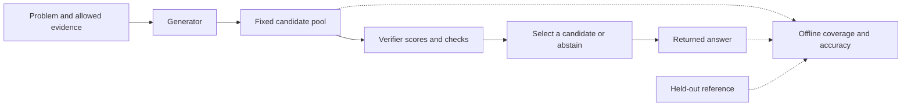
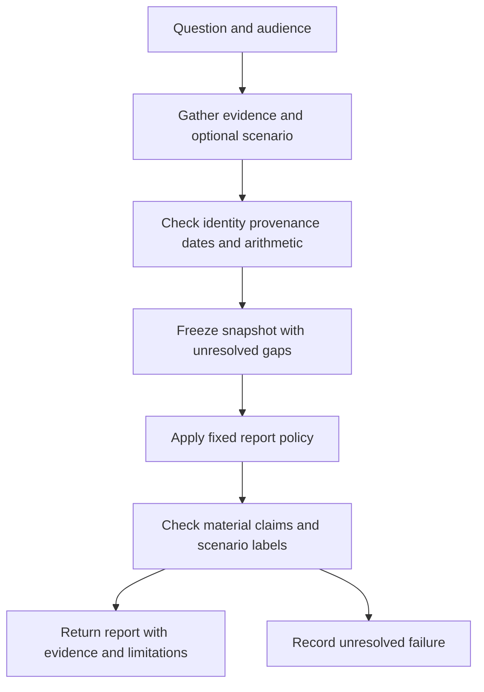

**CS329A Part 3: Robust Verification — Verifier Design, Process Supervision, and Evidence-Grounded Agents**

Prepared 2026-10-02. Companion to [Part 2: Test-Time Compute Scaling](19-cs329a-test-time-compute-scaling.md). This is a technical explanation and implementation guide; no model training, inference experiment, or benchmark evaluation was run for this document.

The central problem is **recognizing which generated outputs deserve to be used**. More computation can produce more correct candidates, but it also produces more plausible mistakes. Robust verification requires a defined correctness target, appropriate evidence, a reliable checking interface, and evaluation of the decisions made from its scores.

The requested [Part 3 explanatory page](https://kenhuangus.github.io/self-improving-agent/#part-03) provides the topic map. The [official Autumn 2025 syllabus](https://cs329a.stanford.edu/) lists four Lecture 3 readings: *Training Verifiers to Solve Math Word Problems*, *Let's Verify Step by Step*, *Math-Shepherd*, and *Shrinking the Generation-Verification Gap with Weak Verifiers*. The explanations below use those original papers and inspected official homework code. CS329A is a course, not a single implemented verification system.

Sections labeled **design guidance**, **derivation**, or **worked example** contain this document's analysis. The EmoGame application preserves the decisions already recorded in Part 2: fixed reporting policy, verification of upstream evidence, and explicitly hypothetical invoice analysis. These extensions remain proposed.

**1. From candidate coverage to trustworthy selection**

For problem $x$, let a generator produce a fixed pool $Y_K=\{y_1,\ldots,y_K\}$. Let $z(x,y)$ be the evaluator's binary correctness label and $s(x,y)$ the score available to the selector. Strict best-of-$K$ returns

$$
\hat y=y_{j^*},\qquad j^*=\arg\max_{1\le j\le K}s(x,y_j).
$$

**Derivation:** define oracle coverage and returned-answer accuracy over the same problem distribution and candidate pools:

$$
C(K)=P\left(\max_j z(x,y_j)=1\right),\qquad
A(K)=P\left(z(x,\hat y)=1\right).
$$

For strict selection, with abstention counted as no correct return,

$$
A(K)\le C(K),\qquad
G(K)=C(K)-A(K).
$$

When $C(K)>0$, selection efficiency is $\eta(K)=A(K)/C(K)$, the probability of returning a correct answer conditional on one existing in the pool. This is undefined when coverage is zero. These identities need no independent-sampling assumption.

**Worked example:** among 100 problems, 80 pools contain a correct candidate and a judge returns a correct candidate on 60. Coverage is 80%, accuracy is 60%, the gap is 20 percentage points, and selection efficiency is 75%. The judge's own confidence scores cannot establish any of these quantities without evaluator labels.

If the judge writes a new answer, that answer may exceed the original pool's coverage ceiling. Record the operation as generation or revision, retain the new artifact, and account for its cost. The distinction is useful when interpreting repeated-sampling research. [Brown et al., *Large Language Monkeys*](https://arxiv.org/abs/2407.21787).



**2. What does a verifier actually verify?**

Use separate dimensions to describe a verifier. Its output format, supervision, and access to evidence are different properties.

| Dimension | Alternatives | Why it matters |
|---|---|---|
| Target | Final answer, individual step, source support, user preference | A good score for one target need not establish another |
| Mechanism | Programmatic check, learned scalar score, generative judgment | Determines the interface and likely failure modes |
| Granularity | Full solution, prefix, step, claim | Determines where feedback can locate a problem |
| Evidence | Specification, source records, execution, reference answer | Determines whether the check is available during inference |
| Decision | Ranking, accept/reject, abstention, revision feedback | Determines which quality metrics are relevant |

An outcome reward model can read the entire reasoning trace while learning from a single final-outcome label. A process reward model learns from feedback attached to intermediate steps. A generative judge can assess either outcomes or steps. A deterministic answer matcher using a reference is not the trained discriminative verifier studied in the GSM8K paper.

**Design guidance:** write down the exact implication of a pass. Valid JSON establishes structure; a matching final answer establishes agreement under a parser; a passed test establishes behavior on that test; a supported citation establishes a relation to a particular source. None automatically establishes complete real-world correctness.

**3. Discriminative verification: the GSM8K approach**

Cobbe et al. generate solutions to training problems, label them by final-answer correctness, and train a separate verifier. Their main recipe samples 100 completions per problem; inference ranks another candidate pool. The verifier predicts correctness at token positions, using outcome-derived labels rather than human judgments of each reasoning step. The paper uses a mean-squared-error verifier objective with auxiliary language modeling. It finds benefits depend on sufficient training data. Its generator/verifier size ablation favors the larger generator with smaller verifier among the configurations compared. [Cobbe et al., Sections 4 and 5](https://arxiv.org/html/2110.14168v2).

The key distinction is between **where predictions are emitted** and **what their labels mean**. Token-level output alone does not establish process supervision.

**Design guidance — generic training contract:** store a problem ID, candidate text, generation configuration, target label, and label provenance. Split by problem before generating or partitioning candidates. Otherwise near-identical solutions to the same problem can leak across training and evaluation.

A binary correctness classifier could use the following illustrative objective:

$$
\mathcal L_{\mathrm{BCE}}=-\frac1M\sum_{i=1}^{M}
\left[z_i\log s_\phi(x_i,y_i)+(1-z_i)\log(1-s_\phi(x_i,y_i))\right].
$$

This is a generic design example, not the historical paper's loss. Record the actual target and objective instead of treating all scalar reward models as interchangeable.

Include plausible incorrect outputs in evaluation. Distinguishing a polished mathematical error from a correct solution tests a different capability from distinguishing a correct solution from unrelated text. Measure ranking on the candidate distribution the system will actually encounter.

**4. Outcome supervision versus process supervision**

Lightman et al. compare reward models trained with final-outcome feedback and intermediate-step feedback on MATH. They evaluate best-of-$N$ selection with a fixed generator, not reinforcement learning of that generator. Process supervision performs better in their studied setting, and active learning improves annotation efficiency. Their scoring uses a product of step scores, treating neutral labels as positive. [Lightman et al., Sections 2–4 and Appendix F](https://arxiv.org/html/2305.20050v1).

| Property | Outcome reward model (ORM) | Process reward model (PRM) |
|---|---|---|
| Label target | Correctness or quality of the complete result | Correctness or quality of identified steps |
| Error localization | A low overall score need not locate the error | Step scores can identify a suspect transition |
| Label acquisition | Often possible from an answer or test outcome | Requires step annotations or a defined automatic proxy |
| Main interpretation risk | Correct answer can conceal faulty reasoning | A step score can be mistaken for a proof |

**Worked example:** a solution asserts $3\times4=15$, then subtracts 3 and returns the reference answer 12. An answer matcher can accept 12. A step check can reject the multiplication. Whether the complete response should count as correct depends on whether the evaluation target includes reasoning validity.

**Design guidance:** define step boundaries and label semantics before training. Distinguish a wrong inference from an uninformative but valid statement, and both from an uncheckable claim. Evaluate whether the checker detects the earliest consequential error, rather than merely assigning low scores after the final answer becomes visibly wrong.

**5. PRM800K and aggregating step scores**

The PRM800K repository describes step ratings of $-1$, $0$, and $+1$, alternative completions, chosen branches, and annotation finish reasons. Phase 2 can stop at the first detected error. Its MATH split reserves 500 problems after expanding training with other problems from the standard test split. Preserve that split when comparing results. [Official PRM800K data documentation](https://github.com/openai/prm800k).

**Design guidance:** do not invent labels for the unannotated suffix after labeling stops. Reconstruct the chosen trajectory correctly, retain annotation provenance, and keep alternative branches attached to the original problem.

For positive-valued step scores $p_1,\ldots,p_T$, possible reductions include

$$
S_{\min}=\min_t p_t,\qquad
S_{\mathrm{prod}}=\prod_t p_t,\qquad
S_{\mathrm{geom}}=\exp\left(\frac1T\sum_t\log p_t\right).
$$

**Derivation and design analysis:** the minimum emphasizes the weakest scored step; the product compounds penalties; the geometric mean normalizes the log score by step count. None is universally best. If every score is 0.95, the product is approximately 0.774 for five steps and 0.358 for twenty. A longer correct explanation can therefore receive a lower product even with identical individual scores. Conversely, normalization may dilute a single serious error among many easy steps.

Choose the reduction using development data and evaluate length and segmentation sensitivity. Clip zeros only with a declared numerical convention. A product of learned scores should not be called the probability of a fully correct solution unless their conditional semantics and calibration justify that interpretation.

**6. Math-Shepherd: automatic process labels**

Math-Shepherd estimates the quality of a reasoning prefix by sampling continuations and checking their final answers. Hard estimation labels a prefix positively if at least one continuation succeeds; soft estimation uses the success fraction. It trains a process reward model and studies both candidate reranking and step-by-step PPO. The paper uses the minimum step score for solution ranking. [Wang et al., Sections 3.3–3.5](https://arxiv.org/html/2312.08935v3).

For $m$ continuations with correctness indicators $b_1,\ldots,b_m$, those targets are

$$
\hat q_{\mathrm{soft}}=\frac1m\sum_{j=1}^{m}b_j,
\qquad
\hat q_{\mathrm{hard}}=\mathbf1\left[\sum_{j=1}^{m}b_j>0\right].
$$

**Derivation:** under independent continuations with success probability $q$, the probability of a positive hard label is $1-(1-q)^m$. Changing the completion budget therefore changes the label distribution even for the same prefix.

**Design interpretation:** continuation success measures recoverability under a particular completer. It need not certify the local validity of the prefix. A later continuation might repair an error; a weak completer might fail after a valid step. Preserve completer identity, sampling settings, budget, and final-answer checker with the labels. Automatic annotation reduces one kind of manual work but introduces generation and verification cost.

Using a frozen PRM during inference and updating generator weights with PPO are separate interventions. Document and evaluate them separately.

**7. Majority voting and generative judges**

Answer voting selects the most frequent normalized answer. It cannot inspect whether reasoning is sound. A generative judge receives a problem and candidate solutions and emits an assessment or selection. It can use details that voting discards, but a persuasive explanation remains a fallible model output.

There is no universal candidate-frequency threshold below which voting fails or judging succeeds. **Worked example:** a correct answer appearing three times can win if seven wrong answers are all different; it loses if one wrong answer appears four times. The full answer distribution and tie rule matter.

Zheng et al. identify position, verbosity, and self-enhancement biases in LLM judging, alongside reasoning limitations. Their agreement with human preferences is evidence about the studied preference-evaluation setting, not proof that judges reliably establish factual correctness. [Original LLM-as-a-judge study](https://arxiv.org/abs/2306.05685v4).

**Design guidance — strict selection interface:**

```json
{
  "candidate_id": "candidate-2",
  "decision": "select",
  "checks": [
    {"criterion": "arithmetic", "status": "pass"},
    {"criterion": "assumptions", "status": "unknown"}
  ],
  "reason": "One short explanation tied to the checked evidence."
}
```

This is an illustrative contract, not the homework schema. Validate membership in the actual pool, allow an explicit abstention, and retain unknown checks. Define which unknowns preclude acceptance. Treat candidate text as material to assess, including any instructions embedded inside it. Test order reversals and paraphrases that preserve content to detect unstable preferences. Rewriting a candidate requires a separate generation record.

**8. Combining weak verifiers: Weaver**

Weaver combines imperfect judges and reward models through weak supervision. It handles heterogeneous outputs with normalization and filters some low-quality verifiers before estimating a combined correctness score. The paper also studies distillation into a smaller verifier. This section uses the June 2025 v1, which predates the course, rather than silently attributing later revisions to the lecture. [Saad-Falcon et al., v1](https://arxiv.org/html/2506.18203v1).

**Design guidance:** an illustrative ensemble score is

$$
S(x,y)=\sum_{r=1}^{R}w_r\,h_r(s_r(x,y)),
$$

where $h_r$ maps an individual score to a declared comparable scale. This formula describes a generic weighted ensemble, not a complete implementation of Weaver's latent-variable model.

Different prompts do not establish independent errors. Judges can share model weights, training data, source mistakes, or a preference for confident prose. Compare the ensemble with its strongest component on held-out decisions, and measure whether additional components catch different errors. Estimate preprocessing and weights on a declared development set, or explicitly report an unlabeled transductive protocol.

For EmoGame, arithmetic checks and evidence-provenance checks have different jobs. A weighted score should not permit good writing or positive sentiment to compensate for a wrong skin identity or an unlabeled hypothetical revenue claim. Keep required checks separate from optional quality preferences.

**9. Why more candidates can make selection worse**

Cobbe et al.'s 6B experiment improves up to 400 completions and then declines as the verifier encounters misleading solutions. That observed turning point is specific to the experiment, not a recommended universal budget. [Original test-time compute experiment](https://arxiv.org/html/2110.14168v2#S5.SS1).

**Derivation:** if each of $m$ incorrect candidates independently has probability $\alpha$ of passing a fixed acceptance check, then

$$
P(\text{at least one false acceptance})=1-(1-\alpha)^m.
$$

For an illustrative $\alpha=0.01$, this is about 9.6% at $m=10$ and 63.4% at $m=100$. These are theoretical values, not measured verifier rates. Independence is a strong assumption, and this event is not identical to a ranking error: an accepted wrong candidate may still lose to a correct candidate.

The example explains why per-candidate accuracy alone is insufficient. A selector repeatedly searching a score's extreme tail needs evaluation at the intended pool sizes. Adaptive revision can also seek outputs that satisfy a flawed checker while leaving the real task unsolved.

**Design guidance:** graph oracle coverage, returned correctness, false acceptance, and cost separately. If coverage rises while returned accuracy falls, inspect selected errors, parser failures, and score distributions before concluding that the generator worsened. A larger verifier, ensemble, different check, or reduced budget is a hypothesis to compare, not an automatic remedy.

**10. Public CS329A homework interfaces**

The following source revisions were rechecked through GitHub's commit API for this document: HW1 `6f6eb053aab7b0a77d7b5947703feea5b56b5fca`; HW2 `f6a763256f1013f49fdddff9cf1c812700f4634a`. These deliberately match Part 2 and are not asserted to be the newest revisions.

| Interface | Inspected behavior | Interpretation |
|---|---|---|
| HW1 `AIME25Verifier.verify` | Extracts a final answer and checks equivalence against supplied ground truth | Reference-based evaluation, not learned process verification |
| HW1 `MajorityVoting` | Provides parsing and sampling scaffolds; voting logic is a TODO | Student exercise, not completed voting implementation |
| HW1 `LLMVoting` | Prompts an aggregator to restate a likely solution; orchestration includes TODOs | Output is not constrained to an existing candidate ID |
| HW2 `LLMJudge` | Specifies `choice` and `reason`, with index-or-null selection; central methods are TODOs | Generative judge scaffold |
| HW2 `HumanEvalVerifier` | Accepts a test snippet or `list[TestCase]`, delegates to a runner, parses execution markers | Executable checking interface requiring harness validation |
| HW2 `LLMUnitTestGenerator` | Prompt construction and generation include TODOs | Synthetic-test generation exercise |

Sources: [HW1 verifier](https://github.com/stanford-cs329a/cs329a-homework1-fall2025-public/blob/6f6eb053aab7b0a77d7b5947703feea5b56b5fca/cs329_hw1/methods/aime25_verifier.py), [HW1 notebook](https://github.com/stanford-cs329a/cs329a-homework1-fall2025-public/blob/6f6eb053aab7b0a77d7b5947703feea5b56b5fca/student_homework1.ipynb), [HW2 notebook](https://github.com/stanford-cs329a/cs329a-homework2-fall2025-public/blob/f6a763256f1013f49fdddff9cf1c812700f4634a/homework.ipynb), [HW2 verifier](https://github.com/stanford-cs329a/cs329a-homework2-fall2025-public/blob/f6a763256f1013f49fdddff9cf1c812700f4634a/cs329_hw/methods/verifiers.py), [HW2 test generator](https://github.com/stanford-cs329a/cs329a-homework2-fall2025-public/blob/f6a763256f1013f49fdddff9cf1c812700f4634a/cs329_hw/methods/llm_unit_test.py).

Two static interface details deserve attention. The judge parser converts a choice to a nonnegative integer but does not itself enforce the upper bound of the supplied pool. The structured-test harness's equality condition can produce an OK marker for an empty test list. A downstream implementation should reject invalid indices and empty verification suites. These observations come from source inspection; this document did not execute or certify the harness.

The requested explanatory page's example judge keys differ from the inspected notebook's `choice` and `reason`. Use the pinned interface when implementing the homework rather than copying the page's illustrative schema.

**11. Generated tests and the evaluation boundary**

HW2 asks students to generate tests from problem descriptions, run a reference implementation on them, and compare candidate pass rates on the subset where that reference passes. This is a useful diagnostic, but it conditions the subset on reference access. The notebook's synthetic pass@$k$ counts pools containing a synthetic-test-passing candidate; it does not by itself establish correctness of a single returned program. [Pinned HW2 exercise](https://github.com/stanford-cs329a/cs329a-homework2-fall2025-public/blob/f6a763256f1013f49fdddff9cf1c812700f4634a/homework.ipynb).

**Design guidance:** keep these questions separate:

| Question | Evidence required |
|---|---|
| Do generated tests reject a known correct implementation? | Reference-on-generated-test diagnostic |
| Do they detect incorrect implementations? | Labeled wrong candidates or controlled mutations |
| Does the selector return correct code? | Evaluate the selected candidate with held-out tests |
| How often can the deployment policy answer? | Full-denominator acceptance and abstention counts |

A trivial or incomplete suite can accept both the reference and incorrect programs. Reference acceptance is therefore only one part of test quality. Report subset size, exclusion reasons, and whole-task performance; a reference-filtered subset should not be described as a reference-free deployment procedure.

Run candidate code through an isolated runner with explicit resource limits. Preserve exceptions, timeouts, test counts, and harness errors separately from semantic failures. Confirm that correct, incorrect, empty-suite, and execution-error cases produce the intended results before trusting aggregate scores. This is engineering guidance, not a claim that the inspected runner passed those checks.

**12. Evaluation: assess decisions, calibration, and cost**

**Design guidance:** freeze candidate pools when comparing selectors. Keep problem splits, generator settings, reference labels, answer normalization, and tie rules fixed. Changes to candidate generation and changes to verification should be distinguishable in the reported comparison.

| Measure | What it answers |
|---|---|
| Oracle coverage $C(K)$ | Did a correct candidate exist? |
| Returned correctness $A(K)$ | Did the policy return one? |
| Selection efficiency $A(K)/C(K)$ | How much available correctness did selection recover? |
| False-positive rate | What fraction of incorrect candidates pass the acceptance rule? |
| Precision among accepted candidates | What fraction of accepted candidates are correct? |
| Abstention / answer rate | How often does the policy decline / return an answer? |
| Error among answered requests | How often is a returned answer wrong? |
| Calibration | Do predicted probabilities match observed frequencies? |
| End-to-end cost | What generation, checking, retries, and routing were consumed? |

Do not confuse the coverage of candidate pools with the answer rate of a selective system. Both are sometimes called coverage in different literatures; label them explicitly.

For probabilistic scores, an illustrative calibration diagnostic is the Brier score,

$$
\operatorname{Brier}=\frac1M\sum_{i=1}^{M}(s_i-z_i)^2.
$$

Ranking and calibration serve different decisions. A strictly increasing score transform preserves ranking while changing numerical confidence thresholds. Tune acceptance thresholds on development data, then evaluate error and answer rate on held-out problems.

Group uncertainty estimates by problem because candidates from one problem share context. Report paired differences for selectors evaluated on identical pools. Include malformed outputs, exceptions, failed calls, and retries in denominators and cost. Count actual tokens and latency, not only calls: a judge reading twenty long candidates can cost more than a short generation.

For robustness, compare equivalent candidate orders, shorter and longer explanations, rare correct answers, plausible wrong answers, shifted task types, and missing evidence. These checks reveal different failure modes; a single average judge score obscures them.

**13. EmoGame: verify evidence before deterministic reporting**

Part 2's [EmoGame application](19-cs329a-test-time-compute-scaling.md) specifies a fixed reporting policy for a fixed evidence snapshot, audience, question, and configuration. Part 3 applies verification to that policy's inputs and material claims. It does not require sampling competing final reports.

**Proposed verification targets:**

| Evidence dimension | Appropriate check | What a pass does not establish |
|---|---|---|
| Official catalog and price | Skin identity, source attribution, original unit, applicable date | A price scenario is an official price |
| Visual interpretation | Link the image to the skin and bound claims to visible content | Wallpaper appearance proves in-game feel or demand |
| Community observations | Trace comments to queries, dates, deduplication and relevant identity | Collected comments represent all players |
| Hypothetical invoices | Scenario identity, assumptions, arithmetic and aggregate reconciliation | Per-skin allocations are observed transactions |
| Report conclusions | Trace each material claim to eligible evidence and its limitations | Fluent prose or complete sections establishes truth |

**Worked example:** a scenario allocates hypothetical revenue to a skin using assumed units and price. Checking the multiplication and reconciliation can establish internal consistency. It cannot turn those assumptions into measured skin sales, even when the aggregate used as a constraint is observed. Keep the scenario label attached to both intermediate values and report conclusions.

**Design guidance:** verification can return `pass`, `fail`, or `unknown` for each claim, with a check identifier and evidence references. A missing official price is a legitimate unknown. A recommendation should reflect that gap rather than infer a factual price from a synthetic allocation. Audience-specific usefulness can be assessed separately after factual and scenario-label requirements are satisfied.



This is a proposed data flow. Any repair or retrieval loop should have an explicit budget, preserve the rejected artifact, and identify the changed evidence. Rechecking unchanged evidence with the same judge does not supply a new independent source.

**14. Current EmoGame implementation boundary**

The following files were inspected on 2026-10-02. These are source-level observations, not runtime verification.

| Component | Current inspected behavior | Capability still proposed here |
|---|---|---|
| [`collect_data`](../agents/local_pipeline.py) | Reads local skin catalog, community signals/evidence profile, image path and competitor subset | Request-time refresh and claim-level source checks |
| [`generate_report`](../agents/local_pipeline.py) | Builds one evidence payload, calls JSON generation, renders six sections, labels text as not manually fact-checked | Traceable verification of each material conclusion |
| [`validate_report`](../agents/prompts.py) | Requires exactly six nonempty string sections and rejects selected misleading phrases | Semantic support, arithmetic and provenance verification |
| [`LocalOllamaClient`](../agents/local_ollama.py) | Uses temperature 0, seed 42, JSON/schema settings and bounded retries | Evidence that output is byte-identical across runtimes or factually correct |
| [Invoice synthesizer](../data/invoice_synthesizer.py) | Keeps synthetic per-skin allocations in dedicated tables and records scenario generation settings | Scenario rows supplied to the inspected local report payload |

The report prompt already instructs the model to distinguish catalog facts, visual judgments, community observations, estimates, and operational rule scores. Instructions express the intended behavior; `validate_report` does not verify all those distinctions. A successfully completed pipeline is therefore not a factual acceptance receipt.

The analogy to process verification is checking observable transformations: matching a source to a skin, converting records into aggregates, computing a scenario, and grounding a claim. This does not mean EmoGame already has a trained PRM or requires access to a model's hidden reasoning.

**15. Applying the evaluation ideas to EmoGame**

**Design guidance:** for a future comparison, use the same question, audience, source snapshot, invoice scenario, model and report policy. Compare the existing structural validator with additional deterministic evidence checks and, separately, a bounded semantic judge. This isolates which checks affect the result. It is an evaluation pattern, not an experiment launched by this documentation task.

Useful labeled cases include a wrong-skin citation, stale feedback presented as current, an official price with the wrong unit, a scenario presented as observed revenue, a mathematically inconsistent aggregate, and an unsupported claim about in-game behavior. Include correct and appropriately uncertain reports so a verifier cannot appear successful merely by rejecting everything.

Measure unsupported-claim acceptance and supported-claim rejection, correct preservation of hypothetical labels, numerical consistency, handling of missing evidence, useful answer rate, and incremental cost. Keep audience usefulness separate from factual gates. Record repaired errors and newly introduced errors when feedback changes the report.

For controlled comparisons, a replayable corpus avoids conflating new live comments with better verification. Freshness remains a separate live-system property. Human labels or evaluator references used for assessment must stay outside the inference policy unless the experiment explicitly permits them.

**16. Source scope and verification record**

| Evidence | Checked source | Scope |
|---|---|---|
| Requested topic map | [Part 3 notes](https://kenhuangus.github.io/self-improving-agent/#part-03) | Secondary navigation and topics; not official answer keys |
| Lecture membership | [Stanford syllabus](https://cs329a.stanford.edu/) | Autumn 2025 Lecture 3 and its four readings |
| Learned outcome verification | [Cobbe et al., v2](https://arxiv.org/html/2110.14168v2) | Training labels, token predictions, size ablation and sampling limit |
| Human process supervision | [Lightman et al., v1](https://arxiv.org/html/2305.20050v1) and [PRM800K](https://github.com/openai/prm800k) | Supervision, aggregation, dataset structure and split |
| Automatic process supervision | [Math-Shepherd, v3](https://arxiv.org/html/2312.08935v3) | Continuation labels, reranking and PPO distinction |
| Weak-verifier ensembles | [Weaver, v1](https://arxiv.org/html/2506.18203v1) | Combination, normalization and weak supervision |
| Judge limitations | [Zheng et al., v4](https://arxiv.org/abs/2306.05685v4) | Model-judge biases and preference-evaluation scope |
| Homework contracts | Pinned files in Section 10 | Commit IDs rechecked and source files read; code not executed |
| Local application | Files in Section 14 and Part 2's recorded decisions | Current static behavior versus proposed extension |

This document is an original technical synthesis, not a transcript or reproduction study. Research findings remain bounded to their reported settings; examples and equations labeled as derivations are explanatory. No homework TODOs were completed, no verifier was trained, and no performance improvement is claimed for EmoGame.
